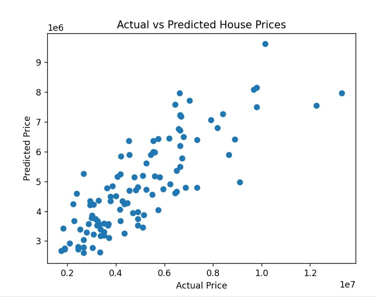
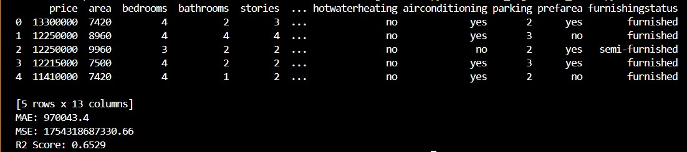

# House Price Prediction using Linear Regression

## 📌 Objective
The objective of this project is to implement Linear Regression and predict house prices using multiple features from a housing dataset.

---

## 🛠 Tools & Technologies Used
- Python
- Pandas
- NumPy
- Scikit-learn
- Matplotlib

---

## 📂 Dataset
- Housing Dataset (`Housing.csv`)
- Contains features like:
  - Area
  - Bedrooms
  - Bathrooms
  - Stories
  - Parking
  - Furnishing status
  - And more

---

## ⚙️ Steps Performed
1. Loaded dataset using Pandas
2. Handled missing values
3. Converted categorical data (yes/no) into numerical values
4. Applied One-Hot Encoding for categorical features
5. Selected features and target variable (price)
6. Split dataset into training and testing sets
7. Trained Linear Regression model
8. Predicted house prices
9. Evaluated model using:
   - Mean Absolute Error (MAE)
   - Mean Squared Error (MSE)
   - R² Score
10. Visualized results using scatter plot

---

## 📊 Output

### Actual vs Predicted Prices



---

## 📈 Results
- MAE: ~970000
- MSE: ~1.75e12
- R² Score: ~0.65

---

## 🧠 Interpretation
The model performs well with an R² score of approximately 0.65, indicating a strong relationship between input features and house prices. The predictions closely follow actual values with some variation.

---

## 🚀 How to Run

1. Install required libraries:
```bash
pip install pandas numpy matplotlib scikit-learn
